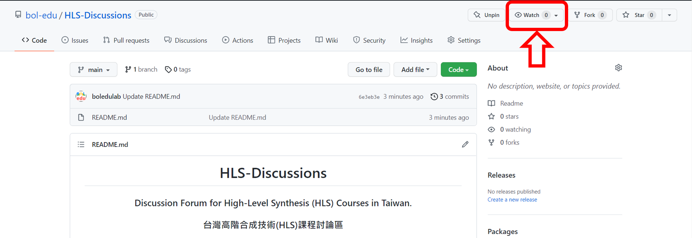
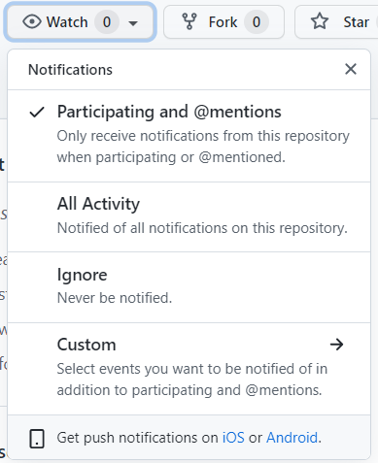
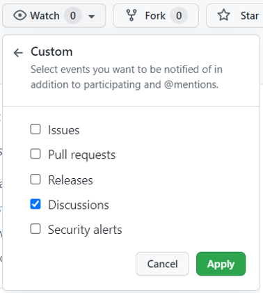
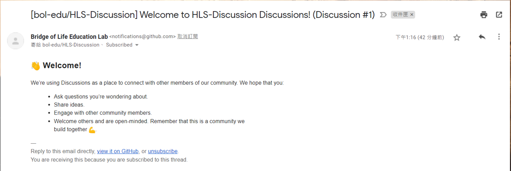
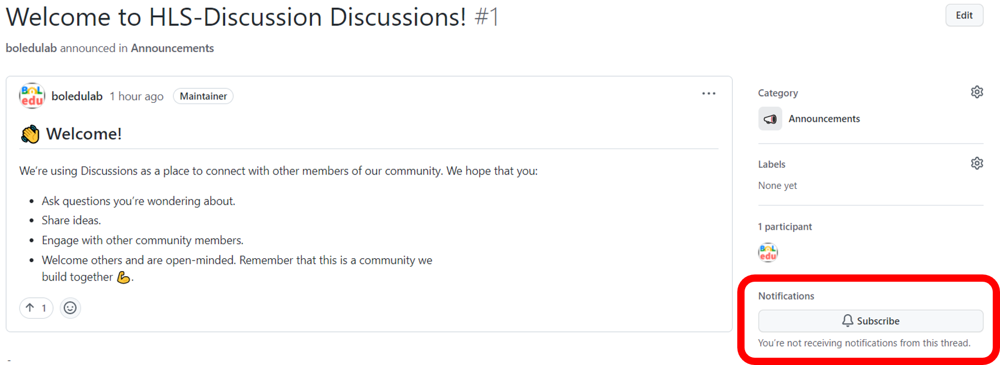

<h1 align="center">HLS-Discussions</h1>

<h3 align="center">Discussion Forum for High-Level Synthesis (HLS) Courses in Taiwan.</h3>

<h3 align="center">台灣高階合成技術(HLS)課程討論區</h3>

## Purpose

This repository is created as a discussion forum for High-Level Synthesis (HLS) courses in Taiwan. Our goal is to promote HLS and build an HLS community in Taiwan, which can further assist the digital transformation of Taiwan's industry.

此儲存庫是建立來做為台灣高階合成技術(HLS)課程的討論區使用。我們的目標是在台灣推廣HLS、建立一個HLS社群，並進一步協助台灣產業的數位轉型。

## General HLS Discussion

For general topics of HLS (e.g., lecture contents, project implementation problems), please use the [Discussions](https://github.com/bol-edu/HLS-Discussions/discussions) of this repository directly.

一般HLS相關議題 (例如：課程內容、專案實作遇到的問題)，請直接使用此儲存庫的[討論區](https://github.com/bol-edu/HLS-Discussions/discussions)進行討論。

## Specific Lab Discussion

For the labs listed below, please go to the repository of the lab and use the discussion forum there.

以下列出的實驗，請移至該實驗儲存庫的討論區進行討論。

* FINN (From AI to Gate) - [course-lab_finn](https://github.com/bol-edu/course-lab_finn/discussions)
* RISC-V (Comet Lab) - [course-lab_riscv](https://github.com/bol-edu/course-lab_riscv/discussions)
* Accelerated Algorithmic Trading - [course-lab_aat](https://github.com/bol-edu/course-lab_aat/discussions)
* PYNQ Composable Pipeline & Partial Programming - [course-lab_pynq-cp-pr](https://github.com/bol-edu/course-lab_pynq-cp-pr/discussions)

## How to Subscribe

Find **"Watch"** button in this repository.

找到 **"Watch"** 按鈕

Choose if you want to get notified of All Activity or selected events (Custom).

選擇你想要接收所有活動通知或是只有選定的事件(Custom)

In "Custom", you can select events you want to be notified of (e.g., Discussions only).

在 "Custom" 中，你可以選擇你想要接收通知的事件 (例如：只接收討論區通知)

You will receive a email notification of anything new in Discussions.

你將會收到討論區中新消息的電子郵件通知。

You can also subscribe a single thread by clicking the **"Subscribe"** button in that thread.

你也可以只訂閱單個討論串，點擊該討論串裡的 **"Subscribe"** 按鈕。

